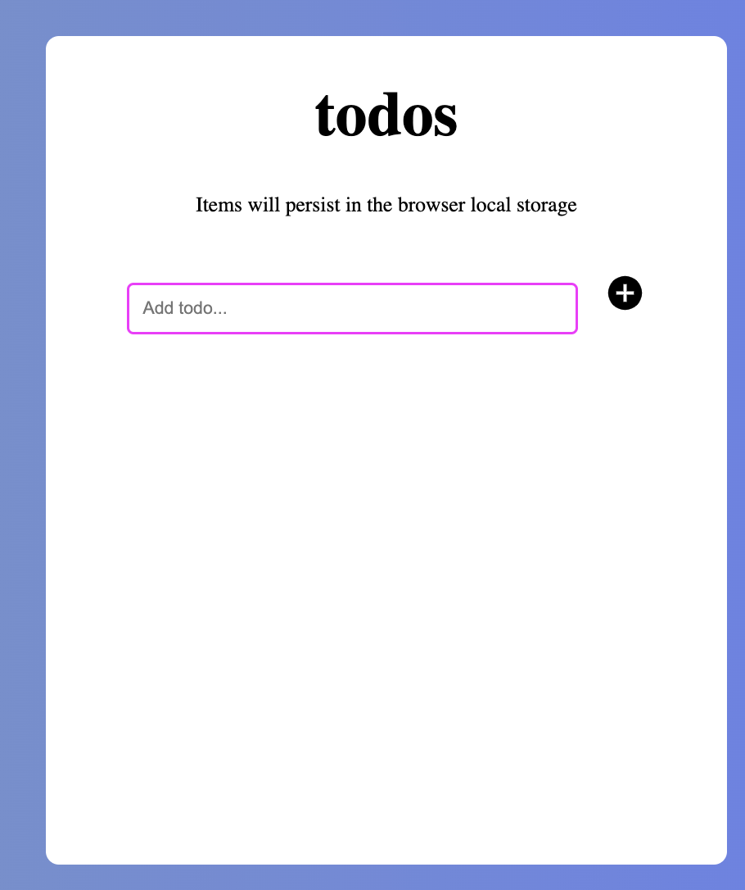

<a name="readme-top"></a>

<!-- TABLE OF CONTENTS -->

<div align="center">

</div>

# 📗 Table of Contents

- [📗 Table of Contents](#-table-of-contents)
- [📖 Exotic Rentals ](#-exotic-rentals--)
  - [Backend](#backend)
  - [🛠 Built With ](#-built-with-)
    - [Tech Stack ](#tech-stack-)
    - [Key Features ](#key-features-)
  - [🚀 Live Demo ](#-live-demo-)
  - [💻 Getting Started ](#-getting-started-)
    - [Prerequisites](#prerequisites)
    - [Setup](#setup)
    - [Install](#install)
    - [Usage](#usage)
    - [Run tests](#run-tests)
    - [Deployment](#deployment)
  - [👥 Authors ](#-authors-)
  - [🔭 Future Features ](#-future-features-)
  - [🤝 Contributing ](#-contributing-)
  - [⭐️ Show your support ](#️-show-your-support-)
  - [🙏 Acknowledgments ](#-acknowledgments-)
  - [📝 License ](#-license-)

# 📖 To do App <a name="about-project"></a>

**To do app** To-do App" is a simple web application where users can add, edit and delete tasks.

## 🛠 Built With <a name="built-with"></a>

### Tech Stack <a name="tech-stack"></a>

<details>
  <summary>Client</summary>
  <ul>
    <li><a href="https://reactjs.org/">React.js</a></li>
    <li><a href="#">CSS</a></li>
  </ul>
</details>

### Key Features <a name="key-features"></a>

- **[Users can Add, Edit and Delete tasks.]**

<p align="right">(<a href="#readme-top">back to top</a>)</p>

## 🚀 Live Demo <a name="live-demo"></a>

- No Live Demo Link

<p align="right">(<a href="#readme-top">back to top</a>)</p>

## 💻 Getting Started <a name="getting-started"></a>

To get a local copy up and running, follow these steps.

### Prerequisites

In order to run this project you need:

### Setup

Clone this repository to your desired folder:

```sh
  cd my-folder
  git clone git@github.com:jugosack/react-todos-app.git
```

### Install

Install this project with:

```sh
  cd react-todo-app
  yarn install
```

### Usage

To run the project, execute the following command:

```sh
  npm start
```

### Deployment

You can deploy this project using:

```sh
  git push main
```

<p align="right">(<a href="#readme-top">back to top</a>)</p>

## 👥 Author <a name="author"></a>

👤 **Jugoslav Achkoski**

- GitHub: [jugosack](https://github.com/jugosack)
- Twitter: [Jugoslav Achkoski](https://twitter.com/Jugosla22401325)
- LinkedIn: [Jugoslav Achkoski](https://www.linkedin.com/in/jugoslav-achkoski-3a074021/?originalSubdomain=mk)

<p align="right">(<a href="#readme-top">back to top</a>)</p>

## 🔭 Future Features <a name="future-features"></a>

- [ ] **[Users can Add, Edit and Delete tasks.]**

<p align="right">(<a href="#readme-top">back to top</a>)</p>

## 🤝 Contributing <a name="contributing"></a>

Contributions, issues, and feature requests are welcome!

Feel free to check the [issues page](../../issues/).

<p align="right">(<a href="#readme-top">back to top</a>)</p>

## ⭐️ Show your support <a name="support"></a>

If you like this project consider giving it a star ⭐️.

<p align="right">(<a href="#readme-top">back to top</a>)</p>

## 🙏 Acknowledgments <a name="acknowledgements"></a>

I would like to thank Microverse for giving me the opportunity to work on this project.

<p align="right">(<a href="#readme-top">back to top</a>)</p>

## 📝 License <a name="license"></a>

This project is [MIT](./LICENSE) licensed.

<p align="right">(<a href="#readme-top">back to top</a>)</p>
